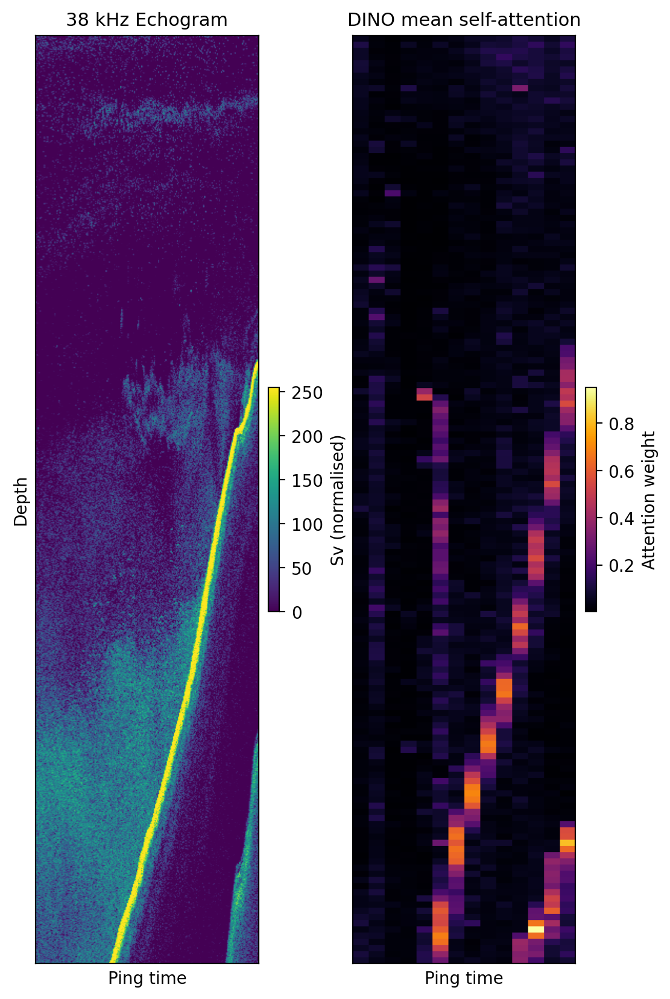
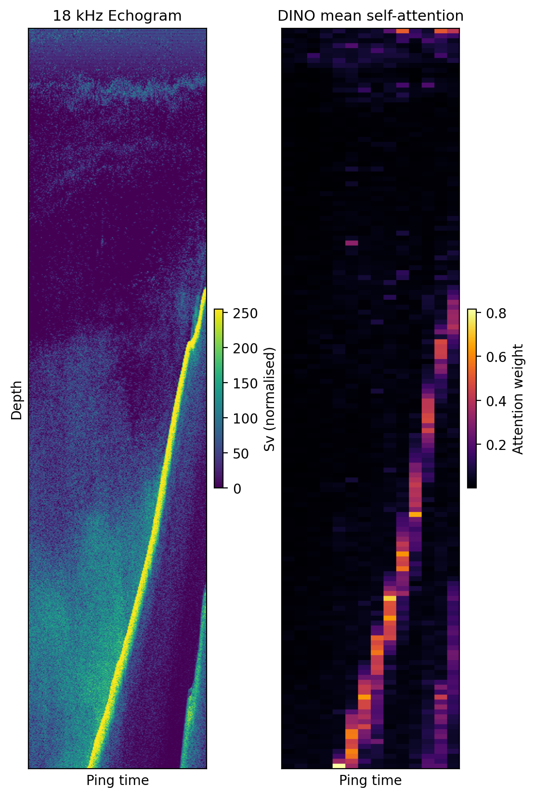
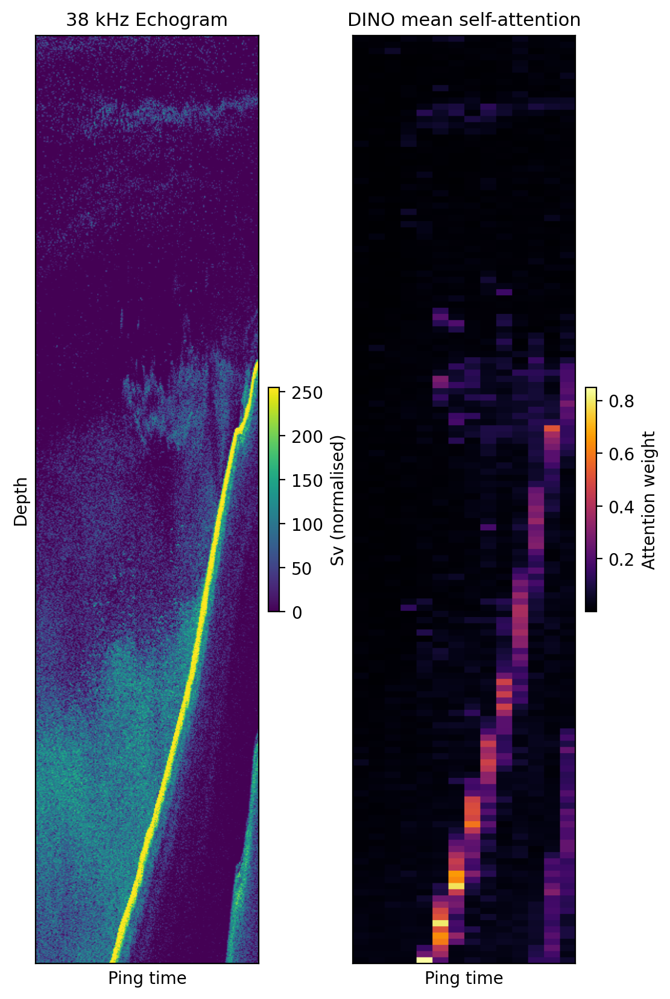
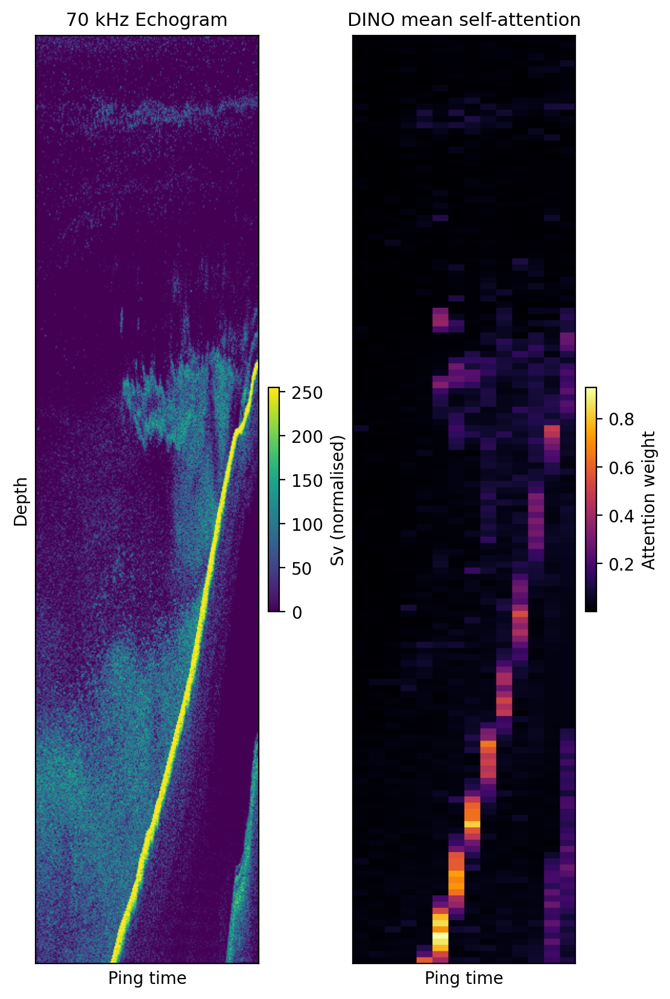
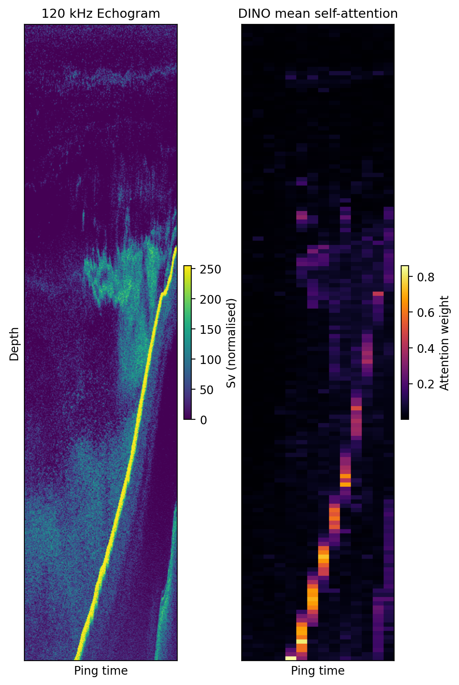
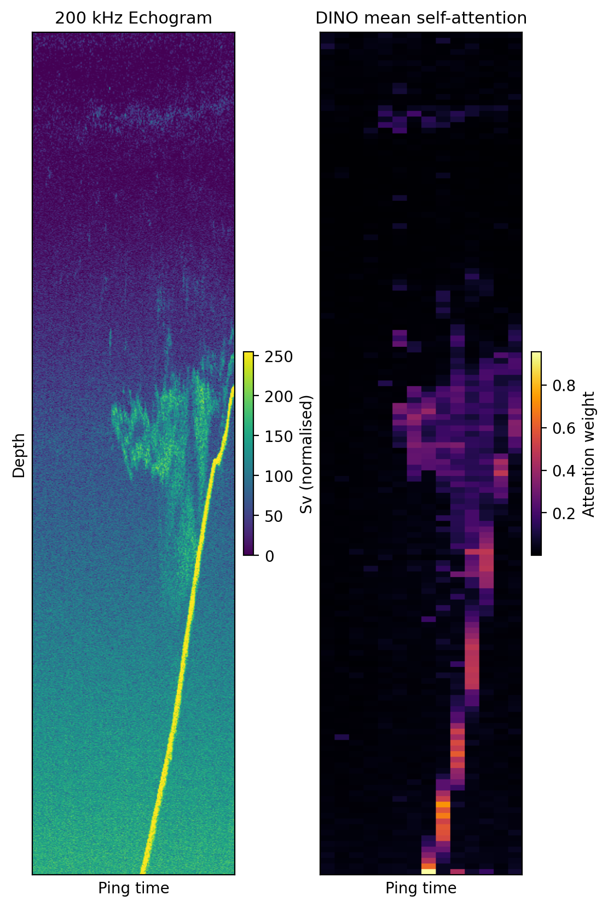

# Gallery

Example outputs from the EchoFlow pipeline processing a NOAA EK80 test file (`Hake-D20230811-T165727.raw`).

## Pipeline overview

The figure below shows a preprocessed echogram (left) alongside the DINO attention map (right), illustrating how the Vision Transformer highlights salient acoustic structures such as fish schools and seabed returns.

## Per-frequency echograms

EK80 wideband echosounders collect data at multiple frequencies simultaneously. Each frequency reveals different scattering characteristics — lower frequencies (18–38 kHz) penetrate deeper and highlight large structures, while higher frequencies (120–200 kHz) resolve finer detail such as individual fish schools.

### 18 kHz

### 38 kHz

### 70 kHz

### 120 kHz

### 200 kHz

